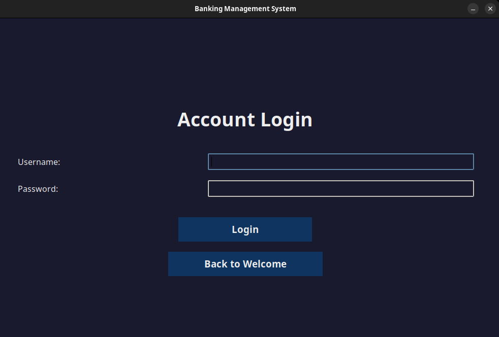
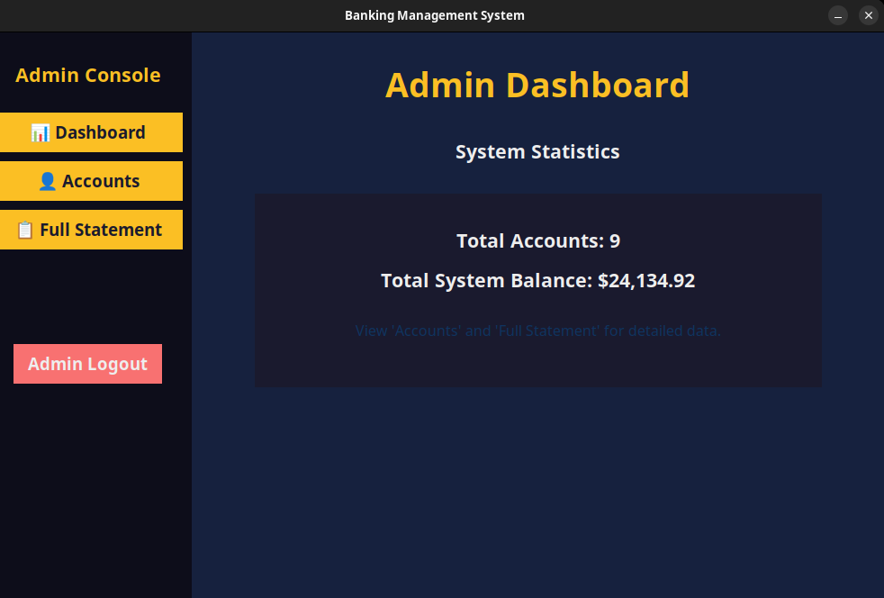
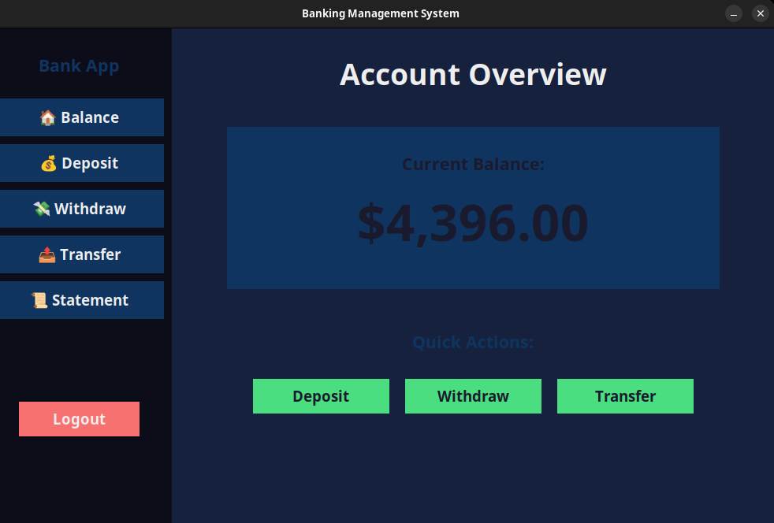

# Banking Management System
 <p><i>Forked from mainlyNitin's Banking Management Systems Project</i></p>
<a id="readme-top"></a>

<div align="center">
  
  <br/>

  <h3><b>Banking Management System</b></h3>
  <p>A comprehensive desktop application for managing banking operations with secure user authentication and transaction processing</p>

</div>

# 📗 Table of Contents

- [📖 About the Project](#about-project)
  - [🛠 Built With](#built-with)
    - [Tech Stack](#tech-stack)
    - [Key Features](#key-features)
  - [🚀 Live Demo](#live-demo)
- [💻 Getting Started](#getting-started)
  - [Prerequisites](#prerequisites)
  - [Setup & Install](#setup)
  - [Usage](#usage)
- [👥 Authors](#authors)
- [🔭 Future Features](#future-features)
- [🤝 Contributing](#contributing)
- [⭐️ Show your support](#support)
- [💝 Credits](#credits)
- [📝 License](#license)

<!-- PROJECT DESCRIPTION -->

# 📖 Banking Management System <a id="about-project"></a>

The **Banking Management System** is a comprehensive desktop application built with Python and Tkinter that provides a complete banking solution. It features separate interfaces for administrators and customers, enabling secure account management, transaction processing, and financial operations.

## 🛠 Built With <a id="built-with"></a>

### Tech Stack <a name="tech-stack"></a>

- **Frontend**: Tkinter (Python GUI)
- **Backend**: Pure Python
- **Database**: SQLite3
- **Language**: Python 3.8+

<!-- Features -->

### Key Features <a id="key-features"></a>

- 🔐 **Secure Authentication** - User registration and login system with password protection
- 👥 **Dual Interface** - Separate admin and user panels with role-based access
- 💰 **Transaction Management** - Deposit, withdraw, and transfer funds between accounts
- 📊 **Balance Inquiry** - Real-time account balance checking
- 📈 **Transaction History** - Complete record of all financial transactions
- 👨‍💼 **Admin Dashboard** - User management, account oversight, and system monitoring
- 📁 **Data Export** - Export transaction history to CSV format
- 🏦 **Account Management** - Create, view, and manage user accounts

### 🚀 Live Demo <a id="live-demo"></a>

> Since this is a desktop application, you can see it in action through these screenshots:

**User Login Interface**


**Admin Dashboard**


**User Dashboard**


<p align="right">(<a href="#readme-top">back to top</a>)</p>

<!-- GETTING STARTED -->

## 💻 Getting Started <a id="getting-started"></a>

To get a local copy up and running, follow these simple steps.

### Prerequisites

- Python 3.8 or higher
- Git
- SQLite3 (usually comes with Python)

### Setup & Install <a id="setup"></a>

1. **Clone the repository**
```sh
git clone https://github.com/Dimah-code/banking-management-system-python.git
cd banking-management-system-python
```

2. **Create a virtual environment (recommended)**
```sh
python3 -m venv venv

# Activate it:
# macOS / Linux
source venv/bin/activate

# Windows (PowerShell)
.\venv\Scripts\Activate.ps1

# Windows (cmd)
venv\Scripts\activate.bat
```

3. **Install dependencies**
```sh
pip install -r requirements.txt
```

4. **Set up environment configuration**
```sh
python3 scripts/setup.py

# Edit the .env file with your preferred text editor
# Set your admin credentials and other configuration values
```

### Usage

1. **Run the application**
```sh
python src/main.py
```

2. **First-time setup**
   - The application will automatically create the SQLite database and required tables
   - Default admin account might be created 

3. **Using the system**
   - **For Users**: Register a new account or login with existing credentials
   - **For Admins**: Use admin credentials(.env file) to access the admin panel
   - Perform transactions, check balances, and export data as needed


<p align="right">(<a href="#readme-top">back to top</a>)</p>

<!-- AUTHORS -->

## 👥 Authors <a id="authors"></a>

👤 **Dimah-code**

- GitHub: [@Dimah-code](https://github.com/Dimah-code)
- LinkedIn: [Hamidreza](https://in/hamidreza-ghareghani-b68b712b9)

👤 **mainlyNitin**

- Github: [@mainlyNitin](https://github.com/mainlyNitin)

<p align="right">(<a href="#readme-top">back to top</a>)</p>

<!-- FUTURE FEATURES -->

## 🔭 Future Features <a id="future-features"></a>

- [ ] **Enhanced Security** - Add password encryption and two-factor authentication
- [ ] **Email Notifications** - Send transaction alerts via email
- [ ] **Mobile App** - Develop a companion mobile application
- [ ] **Advanced Reporting** - Generate PDF reports and financial statements
- [ ] **Multi-Currency Support** - Handle different currencies and exchange rates
- [ ] **Loan Management** - Integrate loan application and management system
- [ ] **API Integration** - REST API for third-party integrations
- [ ] **Data Backup** - Automated database backup system

<p align="right">(<a href="#readme-top">back to top</a>)</p>

<!-- CONTRIBUTING -->

## 🤝 Contributing <a id="contributing"></a>

Contributions, issues, and feature requests are welcome!

1. Fork the Project
2. Create your Feature Branch (`git checkout -b feature/AmazingFeature`)
3. Commit your Changes (`git commit -m 'Add some AmazingFeature'`)
4. Push to the Branch (`git push origin feature/AmazingFeature`)
5. Open a Pull Request

<p align="right">(<a href="#readme-top">back to top</a>)</p>

<!-- SUPPORT -->

## ⭐️ Show your support <a id="support"></a>

If you like this project, please give it a ⭐️! This helps others discover the project and encourages further development.

<!-- ACKNOWLEDGEMENTS -->

## 💝 Credits <a id="credits"></a>

- **Original Project**: This project is forked from [Banking-Management-Systems](https://github.com/mainlyNitin/Banking-Management-Systems) by [mainlyNitin](https://github.com/mainlyNitin)
- Thanks to mainlyNitin for this good project that learn me a lot

<p align="right">(<a href="#readme-top">back to top</a>)</p>

## 📝 License <a id="license"></a>

This project is [MIT](LICENSE) licensed.

<p align="right">(<a href="#readme-top">back to top</a>)</p>
